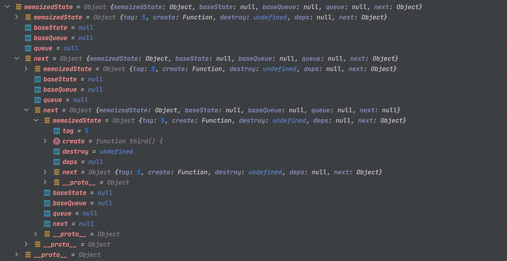
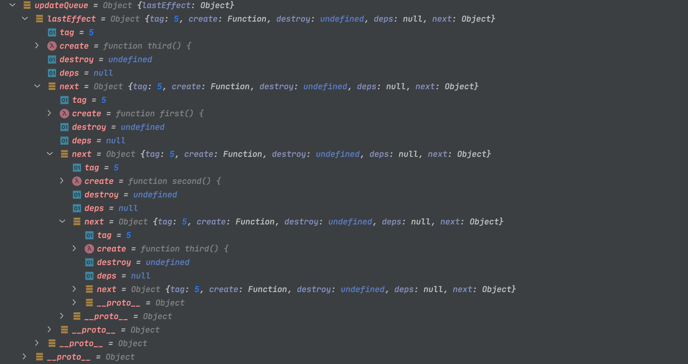

本篇介绍`useEffect`和`useLayoutEffect`：


>   如果你熟悉 React class 的生命周期函数，你可以把 `useEffect` Hook 看做 `componentDidMount`，`componentDidUpdate` 和 `componentWillUnmount` 这三个函数的组合。


### 1.  基础

`useEffect`与`useLayoutEffect`两者最大的区别是执行时机的问题：`useEffect`是异步执行，通过`react`的调度策略在空闲时机执行，`useLayoutEffect`是在`fiber`的`commit`阶段同步执行。这也就造成两者表现上的区别：

1.  `useLayoutEffect`相比`useEffect`，通过同步执行状态更新可解决在一些特殊场景下的闪烁问题。
2.  `useEffect`可以满足百分之99以上的场景，而且`useLayoutEffect`是同步执行，会阻塞渲染。

### 2. mount

<!-- panels:start -->

<!-- panels:title -->

`useEffect`与`useLayoutEffect`挂载阶段对比：

<!-- div:left-panel -->

```javascript
function mountEffect(create,deps) {
  // 此处直接调用mountEffectImpl,设置两个effectTag
  return mountEffectImpl(
    UpdateEffect | PassiveEffect,
    // 这里传入一个passive的标志
    HookPassive,  
    create,
    deps,
  );
}
```

<!-- div:right-panel -->

```javascript
function mountLayoutEffect(create,deps) {
  return mountEffectImpl(
    UpdateEffect,
    // 这里传入一个layout的标志
    HookLayout, 
    create,
    deps
  );
}
```

<!-- panels:end -->

注意这里调用`mountEffectImpl`时传入的`tag`不同，其实在最后的调用阶段就是根据这不同的`tag`来决定是同步调用还是异步调用。


<!-- panels:start -->

<!-- panels:title -->

`mountEffectImpl`与`pushEffect`函数：

<!-- div:left-panel -->

```javascript
function mountEffectImpl(fiberEffectTag, hookEffectTag, create, deps): void {
  // const hook: Hook = {
  //   memoizedState: null,
  //   baseState: null,
  //   baseQueue: null,
  //   queue: null,
  //   next: null,
  // };
	// 与mountState内调用同一个函数，创建一个hook对象
  const hook = mountWorkInProgressHook();
  const nextDeps = deps === undefined ? null : deps;
  // 给当前fiber加上fiberEffectTag标志位
  currentlyRenderingFiber.effectTag |= fiberEffectTag;
	// 挂载到fiber.memoizedState上，以next连接下一个hook对象。
  // 这里memoizedState挂载的是右边函数的effect对象
  hook.memoizedState = pushEffect(
		// 这里的标志位再加上一个HookHasEffect标志位
    HookHasEffect | hookEffectTag,
    create,
    undefined,
    nextDeps,
  );
}
```

<!-- div:right-panel -->

```javascript
function pushEffect(tag, create, destroy, deps) {
  // return 这个effect,挂载到fiber.memoizedState上
  const effect: Effect = {
    tag,
    create,
    destroy,
    deps,
    next: (null: any),
  };

  // 将effect加载fiber.updateQueue链表里
  let componentUpdateQueue: null | FunctionComponentUpdateQueue = (currentlyRenderingFiber.updateQueue: any);
  if (componentUpdateQueue === null) {
    // 返回一个只有{ lastEffect: null }的对象
    componentUpdateQueue = createFunctionComponentUpdateQueue();
    currentlyRenderingFiber.updateQueue = (componentUpdateQueue: any);
    componentUpdateQueue.lastEffect = effect.next = effect;
  } else {
    const lastEffect = componentUpdateQueue.lastEffect;
    if (lastEffect === null) {
      componentUpdateQueue.lastEffect = effect.next = effect;
    } else {
      const firstEffect = lastEffect.next;
      lastEffect.next = effect;
      effect.next = firstEffect;
      componentUpdateQueue.lastEffect = effect;
    }
  }

  return effect;
}
```

<!-- panels:end -->


### 3. update

除此一次执行`renderWithHooks`外，其他阶段都执行`updateEffect`或者`updateLayoutEffect`。

<!-- panels:start -->

<!-- panels:title -->

`useEffect`与`useLayoutEffect`更新阶段：

<!-- div:left-panel -->

```javascript
function updateEffect(create,deps) {
  return updateEffectImpl(
    UpdateEffect | PassiveEffect,
    // 注意这里依然传入的是Passive的标志位
    HookPassive,
    create,
    deps,
  );
```

<!-- div:right-panel -->

```javascript
function updateLayoutEffect(create, deps) {
  return updateEffectImpl(
    UpdateEffect,
    // 这里传入的是Layout标志位
    HookLayout,
    create,
    deps
  );
}
```

<!-- panels:end -->


```javascript
function updateEffectImpl(fiberEffectTag, hookEffectTag, create, deps): void {
  const hook = updateWorkInProgressHook();
  const nextDeps = deps === undefined ? null : deps;
  let destroy = undefined;

  if (currentHook !== null) {
    const prevEffect = currentHook.memoizedState;
    // 当currentHook不为空时，挂载prevEffect执行后返回的函数到destroy上
    destroy = prevEffect.destroy;
    if (nextDeps !== null) {
      const prevDeps = prevEffect.deps;

      // 判断新老依赖是否相同
      if (areHookInputsEqual(nextDeps, prevDeps)) {
        // 注意这里只透传了hookEffectTag，为4，表明只是一个副作用，且没有更新
        pushEffect(hookEffectTag, create, destroy, nextDeps);
        return;
      }
    }
  }

  currentlyRenderingFiber.effectTag |= fiberEffectTag;

  // 新老依赖不同，视为一个新的useEffects
  // 此时destroy为undefined
  // 这里传入了HookHasEffect | hookEffectTag，表明是一个有更新的副作用
  hook.memoizedState = pushEffect(
    HookHasEffect | hookEffectTag,
    create,
    destroy,
    nextDeps,
  );
}
```

### 4. 执行阶段

`useEffect`与`useLayoutEffect`只有在`fiber`的`commit`阶段才会执行，在`commit`阶段会有三个`do...while`循环：

1.  `commitBeforeMutationEffects`渲染`DOM`之前执行的副作用
2.  `commitMutationEffects`渲染`DOM`，进行`DOM`操作
3.  `commitLayoutEffects`渲染完`DOM`之后执行的副作用

#### 4.1 异步执行useEffect

在`commitBeforeMutationEffects`循环里：

```javascript
function commitBeforeMutationEffects() {
  while (nextEffect !== null) {
    // 判断effectTag里是否有副作用Passive的tag
    if ((effectTag & Passive) !== NoEffect) {
      if (!rootDoesHavePassiveEffects) {
        rootDoesHavePassiveEffects = true;
        // 异步调度执行刷新flushPassiveEffects
        scheduleCallback(NormalPriority, () => {
          flushPassiveEffects();
          return null;
        });
      }
    }
    nextEffect = nextEffect.nextEffect;
  }
}
```

`flushPassiveEffects`通过设置优先级调度了`flushPassiveEffectsImpl`：

```javascript
function flushPassiveEffectsImpl() {
  if (rootWithPendingPassiveEffects === null) {
    return false;
  }
  const root = rootWithPendingPassiveEffects;
  const expirationTime = pendingPassiveEffectsExpirationTime;
  rootWithPendingPassiveEffects = null;
  pendingPassiveEffectsExpirationTime = NoWork;

  const prevExecutionContext = executionContext;
  executionContext |= CommitContext;
  const prevInteractions = pushInteractions(root);

  let effect = root.current.firstEffect;
    while (effect !== null) {
      try {
        	// 循环执行Hooks的effect
          commitPassiveHookEffects(effect);
        } catch (error) {
          captureCommitPhaseError(effect, error);
        }
      const nextNextEffect = effect.nextEffect;
      effect.nextEffect = null;
      effect = nextNextEffect;
    }

  executionContext = prevExecutionContext;

  flushSyncCallbackQueue();

  nestedPassiveUpdateCount = rootWithPendingPassiveEffects === null ? 0 : nestedPassiveUpdateCount + 1;

  return true;
}
```


```javascript
export function commitPassiveHookEffects(finishedWork: Fiber): void {
  if ((finishedWork.effectTag & Passive) !== NoEffect) {
    switch (finishedWork.tag) {
      case FunctionComponent:
      case ForwardRef:
      case SimpleMemoComponent:
      case Block: {
        // 限制性destroy，再执行mount，这是为了防止ref指向错误
        commitHookEffectListUnmount(HookPassive | HookHasEffect, finishedWork);
        commitHookEffectListMount(HookPassive | HookHasEffect, finishedWork);
        break;
      }
      default:
        break;
    }
  }
}
```


<!-- panels:start -->

<!-- div:left-panel -->

```javascript
// 循环 FunctionComponent 上的 effect 链，
// 根据hooks 上每个 effect 上的 effectTag，执行destroy/create 操作（类似于 componentDidMount/componentWillUnmount）
function commitHookEffectListUnmount(tag: number, finishedWork: Fiber) {
  const updateQueue: FunctionComponentUpdateQueue | null = (finishedWork.updateQueue: any);
  let lastEffect = updateQueue !== null ? updateQueue.lastEffect : null;
  if (lastEffect !== null) {
    const firstEffect = lastEffect.next;
    let effect = firstEffect;
    do {
      if ((effect.tag & tag) === tag) {
        // Unmount执行destroy
        const destroy = effect.destroy;
        effect.destroy = undefined;
        if (destroy !== undefined) {
          destroy();
        }
      }
      effect = effect.next;
    } while (effect !== firstEffect);
  }
}
```


<!-- div:right-panel -->

```javascript
function commitHookEffectListMount(tag: number, finishedWork: Fiber) {
  const updateQueue: FunctionComponentUpdateQueue | null = (finishedWork.updateQueue: any);
  let lastEffect = updateQueue !== null ? updateQueue.lastEffect : null;
  if (lastEffect !== null) {
    const firstEffect = lastEffect.next;
    let effect = firstEffect;
    do {
      if ((effect.tag & tag) === tag) {
        // Mount执行create阶段
        const create = effect.create;
        effect.destroy = create();
      }
      effect = effect.next;
    } while (effect !== firstEffect);
  }
}
```

<!-- panels:end -->

#### 4.2 同步执行useLayoutEffect

在`commitMutationEffects`阶段执行`commitWork`时，进行`destroy`操作

```javascript
function (current, finishedWork) {
   switch (finishedWork.tag) {
    case FunctionComponent:
    case ForwardRef:
    case MemoComponent:
    case SimpleMemoComponent:
    case Block: {     
      // 循环 FunctionComponent 上的 effect 链，
      // 根据hooks 上每个 effect 上的 effectTag，执行destroy/create 操作（类似于 componentDidMount/componentWillUnmount）
      // 这里执行destroy操作
      // 注意这里只执行tag是HookLayout的副作用
      commitHookEffectListUnmount(HookLayout | HookHasEffect, finishedWork);
      return;
    }
}
```

在`commitLayoutEffects`阶段执行`commitLifeCycles`时，进行`create`操作

```javascript
function commitLifeCycles(finishedRoot, current, finishedWork) {
  switch (finishedWork.tag) {
    case FunctionComponent:
    case ForwardRef:
    case SimpleMemoComponent:
    case Block: {
      // 这里执行create操作
      // 注意只有tag是HookLayout的副作用
      commitHookEffectListMount(HookLayout | HookHasEffect, finishedWork);

      if (runAllPassiveEffectDestroysBeforeCreates) {
        schedulePassiveEffects(finishedWork);
      }
      return;
    }
}
```

### 5. 示例

本文以下面函数为例：

```javascript
import React, { useEffect } from 'react';

function App(props, context) {
	useEffect(function first() {
		console.log(100);
		return function firstReturn() {
			console.log(199);
		}
	});

	useEffect(function second() {
		console.log(200);
		return function secondReturn() {
			console.log(299);
		}
	});

	useEffect(function third() {
		console.log(300);
		return function thirdReturn() {
			console.log(399);
		}
	});

	return 'andy';
}

export default App;
```

执行完`mount`过程代码后，得到的状态如下：

`fiber.memoizedState`：



最后执行副作用的时候是执行`fiber.updateQueue`上的链表：




